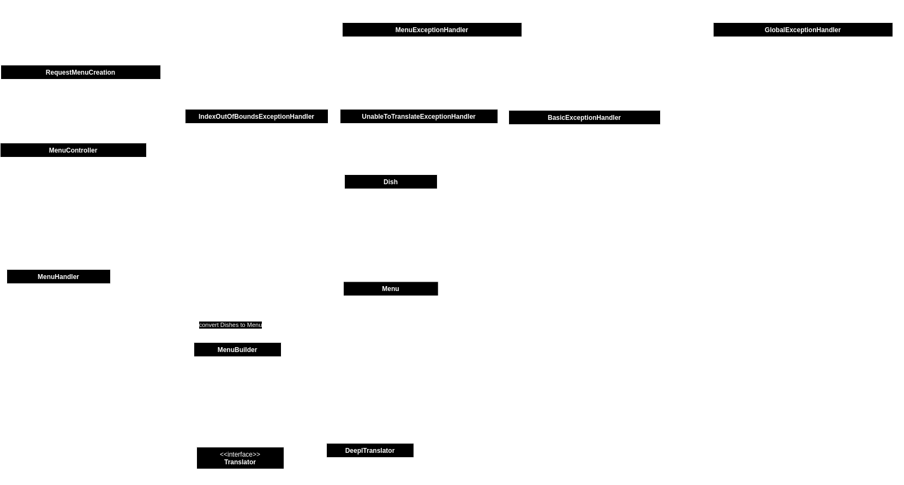

# Authors
Juan Martin Barmasch  
Mateo Bartellini Huapala   
Balint Taschner-Berenguer   

# Setup
This project runs with a spring boot plugin for maven. First of all, an `application.properties` file is needed inside the resources directory. This should have an `authKey` property with an appropriate DeepL API key. Then, the project can be run with `./mvnw spring-boot:run` or with the according plugin in your IDE.
The API exposes 2 endpoints:
1. POST to `localhost:8080/menues`: which expects a menu with preferred and origin languages, a list of dishes (each with its own currency, price and description). For the correct format, please refer to the postman collection.
2. GET to `localhost:8080/menues/{id}`: it returns a previously created menu, in the preferred language specified.

# Brief description
This application addresses the challenge of managing a restaurant where support for many languages may be necessary. It allows users to view a menu consisting of various dishes and select their preferred language for translation. With integration for translation platforms, owners can translate the menu into a variety of languages.

# Design Patterns
**Builder**: We use the Builder pattern in order to initialize an object with Dishes and Language, this enables us to make Menu more dynamic during initialization with different languages or the creation without sides is also possible. This makes the code more readable because the setter methods are in the Builder class

**Chain of responsibility**: For exception and error handling, we create a chain of responsibility. Each handler checks if they can create a valid response given the exception type, and pass it on otherwise.

**Singleton**: We instantiate the various MenuExceptionHandlers as Singleton inside the GlobalExceptionHandler class, since the management of the chain of responsibility does not need to be instantiated more than once. Also, the classes annotated with Autowired are Singletons managed by Spring Boot.

# Resilience

The resilience patterns we chose were mainly focused on the handling of external APIs. We cannot guarantee their successful usage and we don't want to be overcharged for their usage. Therefore, we implemented the CircuitBreaker, Timeout and RateLimiter patterns, through the `resilience4j` library.

## Timeout
We need the external API for translating our dishes' names. But we cannot hang our client indefinitely until we get a response. So we implement a Timeout in order to remove hanging periods for our clients. This could be further accompanied with a Retry pattern.

## Rate Limiter
We use an external API with our own API key. We have a set amount of calls before they charge us. And we also expect a restaurant to create menues in a slow manner. So we implement a Rate limiter in order to limit the number of external API calls our users can trigger, and hopefully save us some money.

## Circuit Breaker
As we depend on an external API, we want to handle unavailability errors in an orderly fashion. That's where the circuit breaker pattern comes through.

# Reflection
The Builder pattern sounded more promising than it is actually in use at the moment, for it to become more useful we would need more attribute possibilities or types, for example by dividing food menus vs drink menus, then the Builder design pattern would be more useful. It would help with the maintainability of the code, as it provides a clean way of adding new attributes to the class without a need of changing a commonly used unique constructor.
The singleton pattern allowed us to force minimal runtime memory usage as having several instances of some classes did not provide any improvements. We implemented them ourselves but they are also widely used in the spring boot framework we used.
The chain of responsibility gave us an easy and maintainable way to handle different error types, as we only have to create a new subclass of the MenuHandlerException and add it to the linked list.
We had also designed this architecture with the strategy pattern in mind, thinking the program should allow the user to use different translation APIs. However, we could not find more than one free translation API in only one week. This is why we have a CustomTranslator interface but only one class that implements it.

In regards with the resilience patterns, with them we are able to improve our user experience, control our usage of external services and possibly cheapen our products' costs.